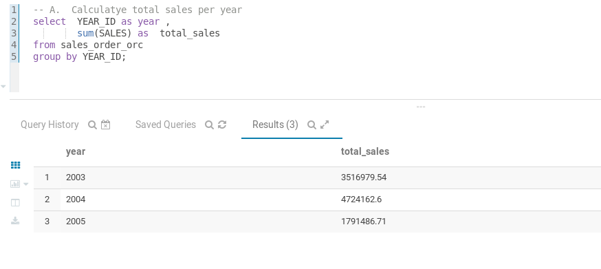
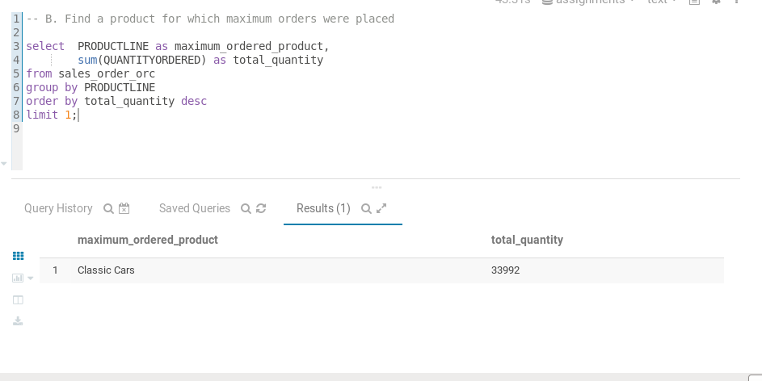
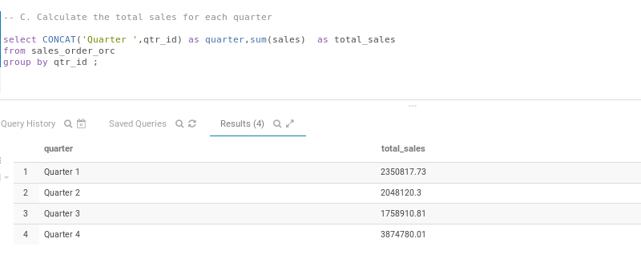
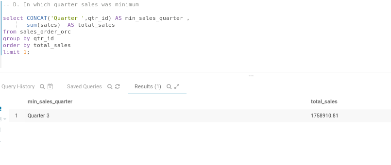
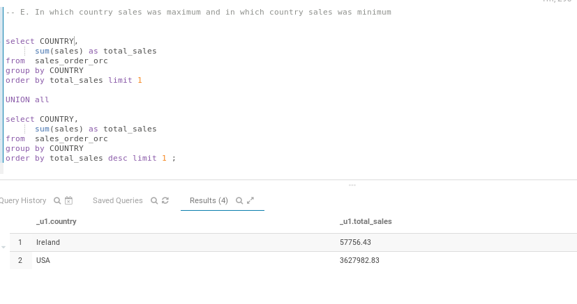
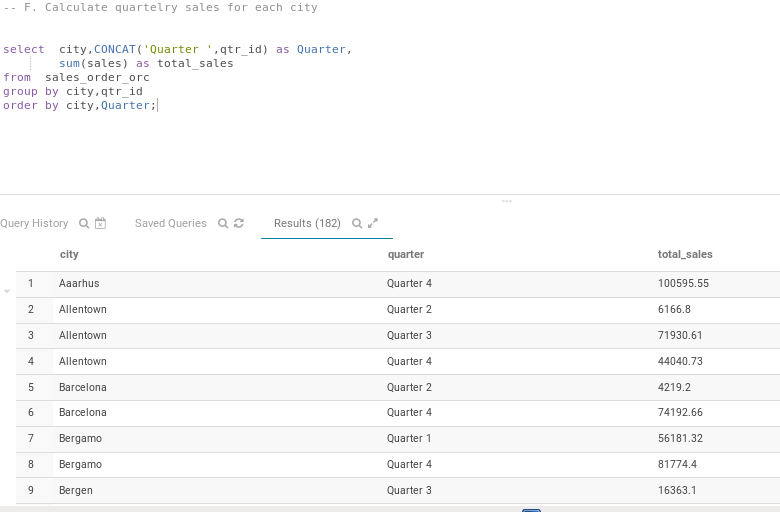
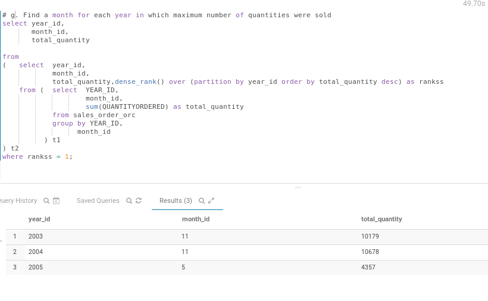

# BASICS HIVE PRACTICAL

### Description 
----
This practical intent to perform basic hdfs as well as  hive operations such as 

 - loading data from local to hdfs
 - creating table in hive
 - loading data in hive with ORC fileformat
 - performing basic queries
 </br>

### DATASET USED : SALES ORDER (DUMMY DATA)
 
 ----


a. Calculatye total sales per year </br>
b. Find a product for which maximum orders were placed </br>
c. Calculate the total sales for each quarter </br>
d. In which quarter sales was minimum </br>
e. In which country sales was maximum and in which country sales was minimum </br>
f. Calculate quartelry sales for each city </br>
g. Find a month for each year in which maximum number of quantities were sold


## PRACTICAL STEPS :
----

### STEP 1 :
 
LOADING DATA FROM HOST LOCAL SYSTEM TO VIRTUAL MACHINE's LOCAL SYSTEM.

```
scp sales_order_data.csv cloudera@192.168.56.101:/home/cloudera/hive
```

-> I generally use filezilla but to demonstrate here i have used scp command.

  </br>


### STEP 2. COPY DATA FROM VM LOCAL TO HDFS LOCATION 
 -> creating directory to store dataset
  ```
hadoop fs -mkdir /datasets
  ```
 -> copying csv file from VM local to hsfs folder we just created

  ```
hadoop fs -put /home/cloudera/hive/sales_order_data.csv /datasets/
  ```

### STEP 3 : LOADING DATA INTO HIVE INTERNAL TABLE
</br> 

-> creating database to store data
```
create database if not exists assignments;

```

-> creating table in assignments database
```
use assignments;
create table sales_order_csv
(
ORDERNUMBER int,
QUANTITYORDERED int,
PRICEEACH decimal(10,2),
ORDERLINENUMBER int,
SALES decimal(10,2),
STATUS string,
QTR_ID int,
MONTH_ID int,
YEAR_ID int,
PRODUCTLINE string,
MSRP int,
PRODUCTCODE string,
PHONE string,
CITY string,
STATE string,
POSTALCODE string,
COUNTRY string,
TERRITORY string ,
CONTACTLASTNAME string,
CONTACTFIRSTNAME string,
DEALSIZE string
)
row format delimited
fields terminated by ',' 
tblproperties("skip.header.line.count" = "1");
```

-> Loading data into sales_order_csv table
```
load data inpath '/datasets/sales_order_data.csv' into table sales_order_csv ;
```

### STEP 4:  LOAD DATA INTO DIFFERENT TABLE IN ORC FILE FORMATE

-> creating new table to store orc data

```
create table sales_order_orc
(
ORDERNUMBER int,
QUANTITYORDERED int,
PRICEEACH decimal(10,2),
ORDERLINENUMBER int,
SALES decimal(10,2),
STATUS string,
QTR_ID int,
MONTH_ID int,
YEAR_ID int,
PRODUCTLINE string,
MSRP int,
PRODUCTCODE string,
PHONE string,
CITY string,
STATE string,
POSTALCODE string,
COUNTRY string,
TERRITORY string ,
CONTACTLASTNAME string,
CONTACTFIRSTNAME string,
DEALSIZE string
)
stored as orc ;
```

-> loading data from sales_order_csv to sales_order_orc

```
from sales_order_csv insert overwrite table sales_order_orc select *;
```


## Queries 

---

A.  Calculatye total sales per year


``` 
  select  YEAR_ID as year ,
          sum(SALES) as  total_sales 
  from sales_order_orc 
  group by YEAR_ID;
```
-> <b>Total sales is shown Below:</b>


B. Find a product for which maximum orders were placed

```
select  PRODUCTLINE as maximum_ordered_product,
        sum(QUANTITYORDERED) as total_quantity  
from sales_order_orc 
group by PRODUCTLINE  
order by total_quantity desc 
limit 1;
```
--> <b>Classic Cars</b> is product for which maximum orders are places </br>



C. Calculate the total sales for each quarter


```
select CONCAT('Quarter ',qtr_id) as quarter,
       sum(sales) as total_sales
from sales_order_orc
group by qtr_id ; 
```
-> <b>Totla quarterly sales is shown below</b>



D. In which quarter sales was minimum </br>

```
select CONCAT('Quarter ',qtr_id) AS min_sales_quarter ,
       sum(sales)  AS total_sales
from sales_order_orc
group by qtr_id
order by total_sales  
limit 1;
```
--> <b>Quarter 2</b> had minimum sales:


E. In which country sales was maximum and in which country sales was minimum

```
select COUNTRY,
      sum(sales) as total_sales
from  sales_order_orc 
group by COUNTRY 
order by total_sales limit 1 

UNION all

select COUNTRY,
      sum(sales) as total_sales
from  sales_order_orc 
group by COUNTRY 
order by total_sales desc limit 1 ;

```
-> <b>Ireland</b> had minimum sales </br>
-> <b>USA</b> had maximum sales


</br>

F. Calculate quartelry sales for each city
```
select  city,CONCAT('Quarter ',qtr_id) as Quarter,
        sum(sales) as total_sales
from  sales_order_orc 
group by city,qtr_id
order by city,Quarter;

```
-> <b>quartelry sales for each city is shown below </b>


g. Find a month for each year in which maximum number of quantities were sold

```
select year_id,
       month_id, 
       total_sales
 
from
(   select  year_id,
            month_id,
            total_sales,dense_rank() over (partition by year_id order by total_sales desc) as rankss 
    from (  select  YEAR_ID,
                    month_id,
                    sum(sales) as total_sales 
            from sales_order_orc 
            group by YEAR_ID,
                  month_id
          ) t1 
) t2
where rankss = 1;
```
-> Month <b>11,11 and 5</b> had manimum number sales for year <b>2003,2004 and 2005 </b>respective.
